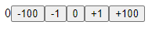
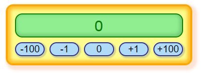

# 4. Mobx in React

```mdx-code-block
import BrowserWindow from '@site/src/components/BrowserWindow';
```

React for me it is functions that can render user interface and Mobx is classes that contains state of application. In this chapter I try to show you how easy and power full is that connection.

During this chapter the app that I create will be counters, with some buttons that will be change counter value.

:::info

If you starting from this point you have two options:

1. Use web editor: [vite.new/react-ts](https://vite.new/react-ts)
2. Or generate project using this command:

```
pnpm create vite my-react-app --template react-swc-ts
```

:::

## Setup the environment

If you prepared in last chapter empty project react project, you need to add two libraries to your project `mobx` and `mobx-react-lite`:

```shell
pnpm install mobx mobx-react-lite
```

You should also delete all thing that we don't need in this project like styles.

Also the `App` component don't need so much elements:

```tsx
function App() {
  return <div>
    Counter
  </div>
}
```

## Create component for counter

Let's start building our counter. Should have place for displaying value and buttons for changing this value (-100,-1,0,+1,+100).

```tsx
const Counter = () => {

  return <div className="counter">
    <span>
      <span>0</span>
    </span>
    <button>-100</button>
    <button>-1</button>
    <button>0</button>
    <button>+1</button>
    <button>+100</button>
  </div>;
};
```

And of course we need to add this component to `App`:

```tsx
function App() {
  return <div className="app">
    <Counter />
  </div>;
}
```

And we should have:

<BrowserWindow>



</BrowserWindow>

Of course we can add more style to this app from this: [style.css](https://github.com/adam-zielonka/mobx-example/blob/main/src/index.css) to file `src/main.css`. Result should be similar to this:

<BrowserWindow>



</BrowserWindow>

## Create store + First spell

We can use `useState` to store value for this component:

```tsx
const Counter = () => {
  const [value, setValue] = useState(0);

  return <div className="counter">
    <span>
      <span>{value}</span>
    </span>
    <button onClick={() => setValue(value - 100)}>-100</button>
    <button onClick={() => setValue(value - 1)}>-1</button>
    <button onClick={() => setValue(0)}>0</button>
    <button onClick={() => setValue(value + 1)}>+1</button>
    <button onClick={() => setValue(value + 100)}>+100</button>
  </div>;
};
```

But in this case we can not access to this value outside component. We can move this value level up, but access also will be limited.

In this case we can build store outside react context to provide access everywhere.

```ts title="Store.ts"
export class CounterStore {
  value = 0

  constructor() {
    makeAutoObservable(this)
  }

  reset = (): void => {
    this.value = 0
  }

  add = (value: string | number): number => {
    if (!isNaN(+value)) this.value = +value
    return this.value
  }
}

export const store = new CounterStore()
```

To say Mobx that this class will be store we need to use first spell `makeAutoObservable` in constructor. After construction this object will be not normal object. Fields change to state, methods to actions and getter to computed values.

## Import store to component + Second spell

So, if we have every thing we can just import this store and use in component:

```tsx title="Store.ts"
import { store } from './Store'

const Counter = () => {
  const { value, add, reset } = store;

  return <div className="counter">
    <span>
      <span>{value}</span>
    </span>
    <button onClick={() => add(100)}>-100</button>
    <button onClick={() => add(-1)}>-1</button>
    <button onClick={() => reset()}>0</button>
    <button onClick={() => add(+1)}>+1</button>
    <button onClick={() => add(+100)}>+100</button>
  </div>;
};
```

But doesn't work, because we need to tell Mobx that this component using our store. We can do that using second spell:

```tsx
const Counter = observer(() => {
  const { value, add, reset } = store;

  return <div className="counter">
    ...
  </div>;
});
```

And this is all magic that you need to know to starting working with mobx. But it isn't everything.

## Global store + Action for adding

We also know the users. One counter is not enough for them. To solve this problem we can create new store that will be contain our `CounterStore`'s.

```ts title="Store.ts"
export class Store {
  counters: CounterStore[] = [new CounterStore()]

  constructor() {
    makeAutoObservable(this)
  }

  addCounter = (): void => {
    this.counters.push(new CounterStore())
  }
}

export const store = new Store()
```

Now, we need to adjust components.

```tsx
const Counter = observer(({ counter }:{ counter: CounterStore }) => {
  const { value, add, reset } = counter;

  return <div className="counter">
    ...
  </div>;
});
```

```tsx
function App() {
  const { counters, addCounter } = store

  return <div className="app">
    {counters.map((counter, i) => <Counter key={i} counter={counter} />)}
    <button onClick={addCounter}>+</button>
  </div>;
}
```

And we need to remember that `App` now have some state that can be change why we need to add first spell and we can use this in the export line.

```tsx
export default observer(App);
```

## Limit number of counters

Sometimes we need to sey to users stop, you can not do this. You can only have 4 counters. So we can add geter that will be return true or false if user can add more counters.

```ts title="Store.ts"
export class Store {
  //...
  get canAddMoreCounters(): boolean {
    return this.counters.length < 4
  }
  //...
  addCounter = (): void => {
    if (!this.canAddMoreCounters) return;

    this.counters.push(new CounterStore());
  }
  //..
}
```

If this getter change all components will be rerender.

We can disable or hide button if we full of counters.

```tsx
function App() {
  const { counters, addCounter, canAddMoreCounters } = store

  return <div className="app">
    {counters.map((counter, i) => <Counter key={i} counter={counter} />)}
    {canAddMoreCounters && <button onClick={(addCounter}>+</button>}
  </div>;
}
```

## Action for deleting

If we can add more counters, we also should have option to remove them.

```ts title="Store.ts"
export class Store {
  //...
  // highlight-start
  removeCounter = (counter: CounterStore): void => {
    this.counters = this.counters.filter(c => c !== counter)
  }
  // highlight-end
  //..
}
```

```tsx
const Counter = observer(({ counter }:{ counter: CounterStore }) => {
  const { value, add, reset } = counter;
  // highlight-next-line
  const { removeCounter } = store

  return <div className="counter">
    <span>
      <span>{value}</span>
      // highlight-next-line
      <button onClick={() => removeCounter(counter)}>X</button>
    </span>
    ...
  </div>;
});
```

:::info

You can start from here using this project: [after-action-for-delete](https://stackblitz.com/github/adam-zielonka/mobx-example/tree/action-for-delete) or you can clone from this [mobx-example](https://github.com/adam-zielonka/mobx-example/tree/action-for-delete) and set branch to `action-for-delete`

:::

## Sum of all counters

```ts title="Store.ts"
export class Store {
  //...
  // highlight-start
  get sum(): number {
    return this.counters.reduce((p, c) => p + c.value, 0)
  }
  // highlight-end
  //..
}
```

```tsx
function App() {
  const { counters, addCounter, canAddMoreCounters, sum } = store

  return <div className="app">
    // highlight-next-line
    <span className="all">{sum}</span>
    {counters.map((counter, i) => <Counter key={i} counter={counter} />)}
    {canAddMoreCounters && <button onClick={(addCounter}>+</button>}
  </div>;
}
```

```diff
-    <span className="all">{sum}</span>
+    <div className='all counter'><span><span>{sum}</span></span></div>
```

## Value to input

```tsx
const Counter = observer(({ counter }:{ counter: CounterStore }) => {
  const { value, add, reset } = counter;
  const { removeCounter } = store

  return <div className="counter">
    <span>
      // highlight-next-line
      <input value={value} onChange={(e) => add(e.target.value)}/>
      <button onClick={() => removeCounter(counter)}>X</button>
    </span>
    ...
  </div>;
});
```

## Console in browser

```ts title="Store.ts"
declare global { interface Window { store: Store; }}
window.store = store
```

## Reaction (Bonus)

Store state in url params

```ts title="Store.ts"
import { makeAutoObservable, reaction } from 'mobx'

export class CounterStore {
  // highlight-start
  constructor(public value = 0) {
    makeAutoObservable(this)
    this.value = value
  }
  // highlight-end
  //...
}

export class Store {
  //...
  // highlight-start
  get toString(): string {
    return this.counters.map(c => c.value).join(';')
  }

  fromString(value: string): void {
    this.counters = value.split(';').map(v => !isNaN(+v) ? new CounterStore(+v) : new CounterStore())
  }
  // highlight-end
  //...
}

export const store = new Store()
// highlight-start
const urlParams = new URLSearchParams(window.location.search)
store.fromString(urlParams.get('value') || '')

reaction(() => store.toString, (value) => {
  const urlParams = new URLSearchParams(window.location.search)
  urlParams.set('value', value)
  window.history.replaceState({}, '', `?${urlParams.toString()}`)
})
// highlight-end

declare global { interface Window { store: Store; }}
window.store = store
```

## Autorun (Bonus)

Store state in localstorage

```ts title="Store.ts"
//...

export const store = new Store()
const urlParams = new URLSearchParams(window.location.search)
// highlight-next-line
store.fromString(urlParams.get('value') || localStorage.getItem('store') || '')

reaction(() => store.toString, (value) => {
  const urlParams = new URLSearchParams(window.location.search)
  urlParams.set('value', value)
  window.history.replaceState({}, '', `?${urlParams.toString()}`)
})

// highlight-start
autorun(() => {
  localStorage.setItem('store', store.toString)
})
// highlight-end

//..
```

## Summary and Ending

Resources:

- [Source code](https://github.com/adam-zielonka/mobx-example)
- [Demo](https://mobx-example.adamzielonka.pro/)
