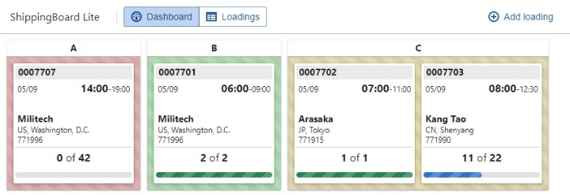
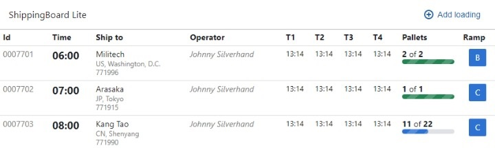

# 5. ShippingBoard Lite

```mdx-code-block
import BrowserWindow from '@site/src/components/BrowserWindow';
```

In this chapter we have job to add additional view to application `ShippingBoard Lite`. Now all loadings are displayed as a table and what business needs is overview what they have on loading ramps. 

What we planning to do is:

<BrowserWindow url="https://adam-zielonka.github.io/shippingboard-lite/">



</BrowserWindow>

But what we have is:

<BrowserWindow>



</BrowserWindow>

## Preparing workspace

To start working on this project you have two option: development using local or online editor:

1. Online Editor
    - Just go to [**stackblitz**](https://stackblitz.com/github/adam-zielonka/shippingboard-lite/tree/create-ramp-view)
2. Local development
    - Clone repo from [**shippingboard-lite**](https://github.com/adam-zielonka/shippingboard-lite/tree/create-ramp-view) and set branch to `create-ramp-view`. You can use this command: 
    ```shell
    git clone --branch create-ramp-view https://github.com/adam-zielonka/shippingboard-lite.git
    ```
    - Open vs code for this project, if you still in terminal you can use this command:
    ```shell
    code shippingboard-lite
    ```
    - Install dependencies:
    ```
    npm install
    ```
    - Run dev server:
    ```
    npm dev
    ```

## Crating new view

Firstly we need to prepare area for our new view, but we also need it to define view also in store and action for changing. Because view is only information that is relevant on frontend there is store created for this purpose: `UI.ts`.

To distinguish on witch of view we are, we need to add field to class UI called `view` and also getters and action for it:

```ts showLineNumbers title='src/store/UI.ts'
// highlight-next-line
type View = "dashboard" | "loadings";
//...
export class UI {
  // highlight-next-line
  view: View = "dashboard";
  //...

  get isDashboardOpen(): boolean {
    return this.view === "dashboard";
  }

  get isLoadingsOpen(): boolean {
    return this.view === "loadings";
  }

  openDashboard = () => {
    this.view = "dashboard";
  };

  openLoadings = () => {
    this.view = "loadings";
  };
}
//...
```


